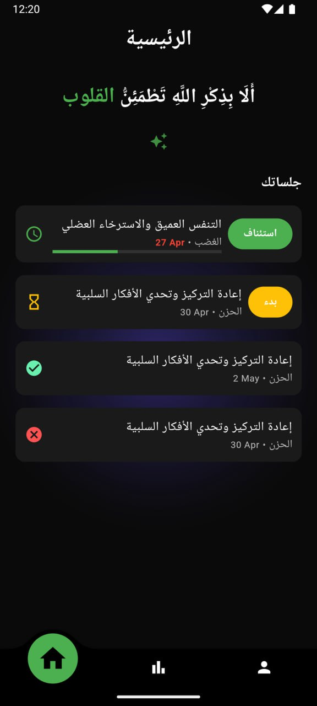

# Kawamen (كَوامِن)

**Kawamen** is a mobile-based wellbeing application that leverages **Speech Emotion Recognition (SER)** to passively detect negative emotional states from a user’s voice and provide **immediate, emotion-specific treatments**. The application is designed to integrate seamlessly into daily life, offering non-intrusive emotional support without requiring manual input, wearables, or continuous user interaction.

---

## 📱 Project Overview

In today’s fast-paced, digitally driven world, individuals often overlook their mental and emotional wellbeing due to constant distractions such as work pressure and social media. Many existing mental health solutions rely on manual mood tracking, journaling, or external devices, which can be inconvenient or inaccessible.

**Kawamen addresses this gap** by using speech emotion detection to analyze vocal patterns in real time and identify negative emotions such as **sadness and anger**. Once an emotion is detected, the system immediately suggests appropriate treatments (e.g., breathing exercises) tailored to the detected emotional state.

The application operates **passively** after microphone permission is granted, ensuring a smooth and user-friendly experience that fits naturally into users’ daily routines.

---

## 🎯 Objectives

* Provide immediate emotional awareness through passive speech analysis
* Support users in managing negative emotions before they escalate
* Offer culturally relevant and accessible wellbeing support
* Eliminate the need for wearables or manual emotion input
* Deliver a simple, intuitive, and engaging user experience

---

## 🧠 Key Features

* **Passive Speech Emotion Detection**

  * Analyzes tone, pitch, and speech patterns in real time
  * Detects negative emotions without active user input

* **Emotion-Specific Treatments**

  * Immediate treatment suggestions based on detected emotions
  * Options to accept, reject, or postpone treatments

* **Treatment Management**

  * Start, pause, resume, and track ongoing treatments
  * View treatment history

* **Emotional Dashboard & Reports**

  * Visualize emotional trends and treatment statistics
  * Export emotional reports for personal insight

* **User Account Management**

  * Secure registration, login, password reset, and profile management

---
## 🖼️ Screenshots

Below are selected screenshots that highlight the core user experience of Kawamen. 

---

## 🎥 Demo Videos (Treatment Lifecycle)

To better demonstrate the treatment lifecycle and real user interaction flow, demo videos are provided via Google Drive links.

Treatment Lifecycle Demos

🎬 Deep Breathing SessionShows the full flow from emotion detection → treatment suggestion → guided deep breathing session.

🔗 [Watch Video on Google Drive](https://drive.google.com/file/d/1s-OSzkd9yX2faRLbBdpguJu5Z99hlhAh/view?usp=sharing)

🎬 CBT Therapy SessionDemonstrates a CBT-based treatment flow including prompts, user interaction, and session completion.

🔗 [Watch Video on Google Drive](https://drive.google.com/file/d/1rwzNnzferlmA3c6Mo5uRvGDKkIW_Nh2i/view?usp=sharing)

---

## 🏗️ System Architecture

Kawamen follows a **hybrid MVC + BLoC architecture**, optimized for Flutter applications:

* **View Layer**: UI components (Login, Dashboard, Treatment Screens)
* **Controller Layer**: BLoC state management for authentication, emotion detection, treatments, and dashboard logic
* **Model Layer**: Domain models, Firebase services, and external Emotion Detection API integration

This architecture ensures:

* Clear separation of concerns
* Reactive UI updates
* Scalability and maintainability

---

## 🛠️ Technologies Used

* **Frontend**: Flutter (Dart)
* **State Management**: BLoC
* **Backend / Services**:

  * Firebase Authentication
  * Firebase Cloud Firestore
* **Emotion Detection**: Speech Emotion Recognition API (AudEERING)
* **Design & Prototyping**: Figma
* **Version Control**: Git & GitHub
* **Project Management**: Jira

---

## 🔐 Permissions & Privacy

* The application requires **microphone access** to enable passive emotion detection.
* Audio data is processed only for emotion analysis purposes.
* User data and emotional records are securely stored using Firebase services.

---

## 🚧 Limitations

* Limited emotional scope (focus on core negative emotions)
* Dependence on external Emotion Detection API performance
* Accuracy may be affected by background noise or audio quality

---

## 🔮 Future Enhancements

* Support for additional emotions and emotional intensity levels
* Personalized treatment recommendations using historical data
* Multi-language support
* Enhanced analytics and long-term emotional insights

---

## 👩‍💻 Team

* **Miriam Almogren**
* Riyam Alsuhaibani
* Shouq Alqureshi
* Raghad Alotaibi

Supervised by **Dr. Mashael Maashi**

---

## 📌 Academic Context

This project was developed as part of the **Software Engineering Graduation Project** at King Saud University and demonstrates the application of:

* Requirements engineering
* System analysis & design
* Mobile application development
* AI-driven emotion analysis
* Software testing and quality assurance

---

## 📄 License

This project is intended for academic and educational purposes.

---

If you find this project interesting or useful, feel free to explore the codebase and documentation ⭐
